# AI Team Intern Audit

This repository contains the analysis and decision work I did for the FlamAI AI Team Intern assignment.

The work covers multilingual tokenizer behavior, serving capacity, throughput, benchmark validation, and my final recommendation for the proposed multilingual casual-style change.

---

## How I approached this

I treated this as an analysis-and-decision exercise rather than just a set of calculations to run. Concretely, that meant:

- Preparing and checking the multilingual corpus myself instead of trusting the sample as-is
- Measuring tokenizer fertility across languages
- Checking whether lowercasing was distorting the results
- Comparing script-level and corpus-level calculations against each other
- Cross-checking the GPT-2 results against a second tokenizer (XLM-R)
- Reviewing serving capacity and KV-cache behavior from the model spec
- Analyzing the long-context throughput numbers in the benchmark log
- Looking at preemption and latency behavior together, not in isolation
- Working out the single most useful metric for confirming KV-cache pressure
- Writing a final decision memo and Day-1 experiment plan for the style-change question

---

## Repo layout

### Part A — Tokenizer Audit

Fertility measurements, the problems I found in the original script and metric, cross-language comparisons on a real corpus, and what this means for production cost and routing.

- `partA/A2_audit.md`
- `partA/A3_corrected_analysis.md`
- `partA/corpus_prep.md`
- `partA/memo.md`
- `partA/corpus/`

The corpus I built contains English, Hindi, Kannada, and Tamil text.

### Part B — Serving Capacity and Throughput

KV-cache capacity math, long-context throughput behavior, preemption, latency, and what the benchmark's reported throughput metric is actually measuring.

- `partB/capacity_reconciliation.md`

This section is mostly about why increasing batch size stopped helping — and eventually started hurting — throughput on the long-context workload.

### Part C — Decision Memo

My recommendation and experiment plan for the multilingual casual-style change.

- `partC/memo.md`

The decision weighs tokenizer behavior, serving constraints, likely production cost, and the fact that none of this means anything without validation on representative traffic.

---

# Key Results

## GPT-2 Tokenizer Fertility

I ran the GPT-2 tokenizer across English, Hindi, Kannada, and Tamil using the corpus I built (see Part A below for how).

| Language | Fertility (tok/word) | tok/char |
|----------|---------------------:|---------:|
| English  | 1.28 | 0.215 |
| Hindi    | 7.83 | 1.528 |
| Kannada  | 22.95 | 2.655 |
| Tamil    | 24.87 | 2.717 |

That's a large difference in tokenization behavior across languages. Relative to English:

- Hindi: **6.10×**
- Kannada: **17.89×**
- Tamil: **19.39×**

Same workload, wildly different token counts depending on the language. That's the number the original report leaned on.

But a big number by itself doesn't tell you why it's big, and I didn't want to just repeat it without checking what's actually driving it. So the rest of this section is me trying to explain that gap — checking whether it's the script's calculation method, the lowercasing step, or the tokenizer itself, before concluding anything about what it means for production.

---

## Lowercase Tokenization Check

The script lowercases every line before tokenizing. Since GPT-2 is case-sensitive, that step can change token counts, so I checked how much.

| Language | Before | After | Delta | Change |
|----------|-------:|------:|------:|-------:|
| English  | 25,741 | 26,696 | 955 | 3.71% |
| Hindi    | 191,828 | 191,842 | 14 | 0.01% |
| Kannada  | 349,772 | 349,802 | 30 | 0.01% |
| Tamil    | 397,163 | 397,189 | 26 | 0.01% |

English changed noticeably — makes sense, GPT-2 has distinct tokens for capitalized forms of common words. The three Indic languages barely moved at all, which also makes sense, since none of them have a case distinction for GPT-2 to lose in the first place.

So lowercasing is not what's producing the large fertility gap in the Indic languages. It's worth documenting, but it's not the explanation.

---

## Script-Level vs Corpus-Level Comparison

The script computes fertility per line and then averages those per-line values, rather than computing one ratio over the whole corpus. I wanted to know if that averaging choice was itself distorting the headline numbers, so I computed both and compared.

| Language | Script Avg | Corpus Ratio | Delta |
|----------|-----------:|-------------:|------:|
| English  | 1.283 | 1.274 | 0.009 |
| Hindi    | 7.826 | 7.796 | 0.030 |
| Kannada  | 22.946 | 22.670 | 0.275 |
| Tamil    | 24.867 | 24.618 | 0.249 |

The two methods land close to each other. There's a small, real difference — a bit larger for Kannada and Tamil than for English and Hindi — but nowhere near large enough to explain the overall fertility pattern. This tells me the averaging method is a minor methodological wrinkle, not the source of the headline gap.

---

## Tokens-per-Character Cross-Check

I ran the same kind of comparison using tokens-per-character as the denominator instead of tokens-per-word, as another independent check on the same question.

| Language | Script TPC | Corpus TPC | Difference |
|----------|-----------:|-----------:|-----------:|
| English  | 0.2152 | 0.2132 | +0.0019 |
| Hindi    | 1.5276 | 1.5287 | -0.0011 |
| Kannada  | 2.6555 | 2.6551 | +0.0004 |
| Tamil    | 2.7171 | 2.7181 | -0.0011 |

Corpus-level and script-level numbers are very close here too. This is a second, independent confirmation that the calculation method itself isn't what's producing the big cross-language differences — the numbers are stable regardless of how you aggregate them.

---

# XLM-R Comparison

Once I'd ruled out averaging method and lowercasing, the remaining suspect was the tokenizer itself. GPT-2's vocabulary was built mostly from English-heavy training data, so it seemed likely it just doesn't represent Indic scripts efficiently. I tested that by running the same corpus through XLM-R, a tokenizer trained multilingually from the start.

| Language | tok/word | tok/char |
|----------|---------:|---------:|
| English  | 1.38 | 0.232 |
| Hindi    | 1.49 | 0.445 |
| Kannada  | 2.57 | 0.460 |
| Tamil    | 2.42 | 0.414 |

This changes the picture completely. XLM-R's results are far more balanced across languages than GPT-2's.

For example, GPT-2 produced approximately **22.95 tokens/word** for Kannada, while XLM-R produced approximately **2.57 tokens/word**.

For Tamil, GPT-2 produced approximately **24.87 tokens/word**, while XLM-R produced approximately **2.42 tokens/word**.

So the takeaway isn't "Indic languages are inherently harder to tokenize" — it's that GPT-2 specifically handles them badly, and a tokenizer chosen for multilingual coverage mostly closes the gap. Fertility should be read as a property of the tokenizer-language pair, not as some fixed property of the language on its own.

---

## XLM-R Tokens-per-Grapheme Results

For completeness, I also computed tokens-per-grapheme for the XLM-R run, as a second denominator on the same tokenizer:

| Language | Tokens/grapheme |
|----------|----------------:|
| English  | 0.232 |
| Hindi    | 0.445 |
| Kannada  | 0.460 |
| Tamil    | 0.414 |

This gives another angle on the same underlying tokenizer behavior and is consistent with the tok/word story above.

---

# Serving Capacity and Throughput

Part B is about the relationship between serving capacity, KV-cache usage, context length, preemption, latency, and what the benchmark's reported throughput number is actually measuring. My approach here was to not trust a single throughput number in isolation, but to interpret it together with what the scheduler was actually doing underneath it.

See `partB/capacity_reconciliation.md` for the full write-up.

---

## Long-Context Benchmark Configuration

The long-context sweep in the benchmark uses:

- **3584-token prompts**
- **512 generated tokens**

So every request in that sweep reaches:

**3584 + 512 = 4096 tokens**

This matters because the full context length is what determines KV-cache requirements, which in turn determines how many requests can actually run concurrently — which is the whole question Part B is trying to answer.

---

# Benchmark Log Validation

The relevant rows from the log:

| Batch | KV Utilization | Preempted Sequences |
|------:|---------------:|--------------------:|
| 24 | 0.93 | 0 |
| 32 | 0.97 | 7 |
| 48 | 0.97 | 23 |

KV-cache utilization climbs toward its ceiling as batch size increases, and preempted sequences go from zero at batch 24 to seven at batch 32 to twenty-three at batch 48. That's the scheduler under increasing pressure as concurrency rises past what the GPU can actually hold.

### Benchmark Log Validation Screenshot


---

# Long-Context Throughput Anomaly

The long-context sweep shows something that doesn't match the naive "more batch = more throughput" expectation.

| Batch | Reported tok/s | TTFT p50 (ms) | ITL p50 (ms) | Preempted Sequences | KV Utilization |
|------:|---------------:|--------------:|-------------:|--------------------:|---------------:|
| 16 | 1311.4 | 498.3 | 77.2 | 0 | 0.62 |
| 24 | 1607.4 | 500.5 | 96.07 | 0 | 0.93 |
| 32 | 1384.0 | 636.9 | 101.79 | 7 | 0.97 |
| 48 | 1298.5 | 955.4 | 100.0 | 23 | 0.97 |

Reported throughput rises from batch 16 to batch 24, as expected. But from batch 24 onward it actually falls, even though batch size keeps increasing. At the same time:

- TTFT climbs
- ITL climbs
- KV utilization stays pinned near its ceiling
- Preempted sequences rise sharply

So past a certain point, adding more concurrent requests doesn't buy you more useful throughput — it costs you some, because the system starts preempting and re-processing work instead of making forward progress.

### Long-Context Throughput Screenshot

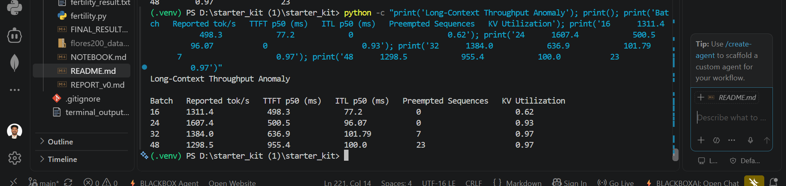

---

# KV-Cache Pressure

If I had to pick one metric to confirm that this whole mechanism is really about KV-cache pressure rather than something else, it's the scheduler's preempted-sequence count, read alongside KV-cache utilization. Preemption is the most direct, hardest-to-misread signal that the scheduler is out of room.

| Batch | Preemptions |
|------:|------------:|
| 24 | 0 |
| 32 | 7 |
| 48 | 23 |

Preemptions rising in lockstep with KV utilization sitting near 0.97 is about as direct a confirmation as you can get from this log alone — larger batches are pushing the system past what it can actually hold in memory.

### KV-Cache Pressure Screenshot

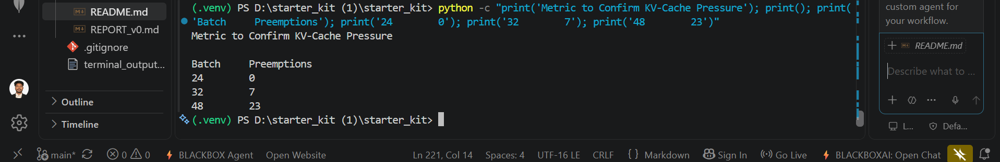

---

# Decision and Recommendation

Part C brings all of this together into a decision memo for the proposed multilingual casual-style change. My recommendation there accounts for:

- what I learned about multilingual tokenization behavior in Part A
- the serving and capacity constraints established in Part B
- the likely production cost impact of each option
- throughput and latency implications
- how I'd actually design the first experiment
- the need to validate on traffic that looks like the real thing, not a toy set

See `partC/memo.md` for the full memo. The short version is that I don't think any single fertility number or throughput number is enough on its own to justify a production decision — they're diagnostics, not verdicts.

---

# Results / Screenshots

These are the screenshots backing the numbers above, in the order they're referenced.

## GPT-2 Fertility Benchmark

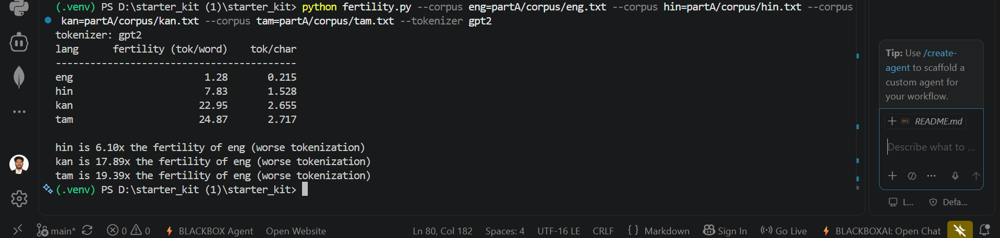

## GPT-2 Fertility Results

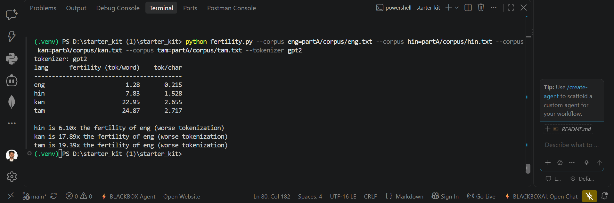

## Corrected Tokenizer Analysis

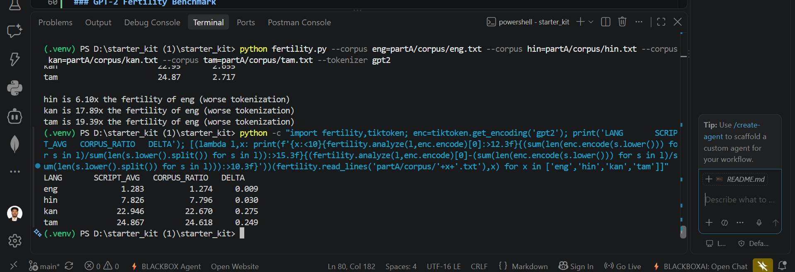

## Lowercase Tokenization Comparison

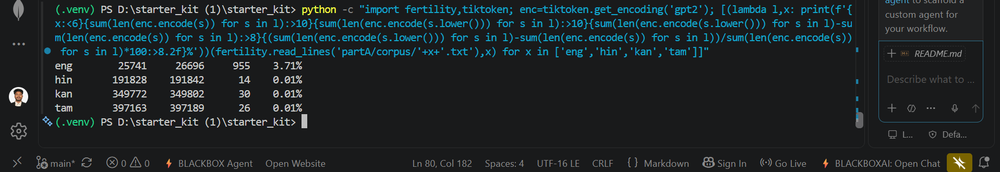

## Corpus Encoding Check

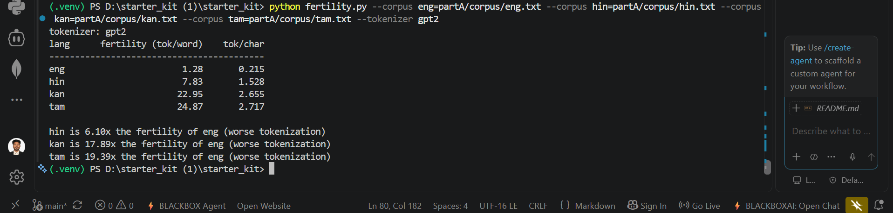

## Tokens-per-Character Comparison

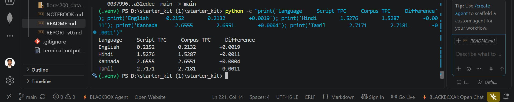

## XLM-R Cross-Check

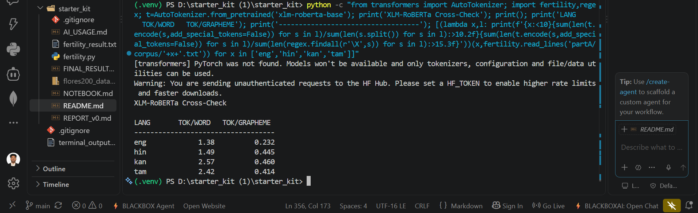

## Benchmark Log Validation


## Long-Context Throughput


## KV-Cache Pressure


### XLM-R Cross-Check


### XLM-R Fertility Graph

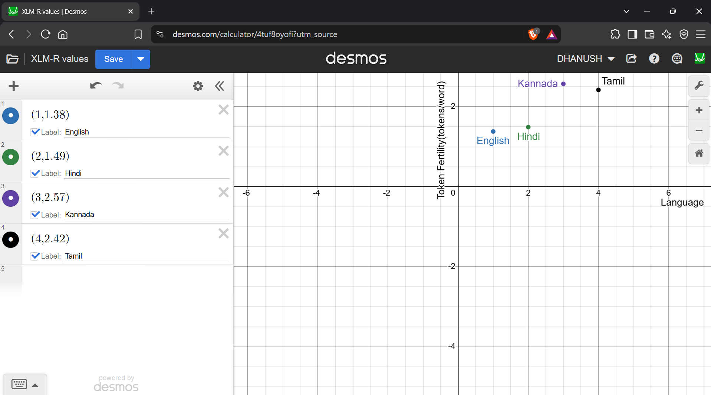

### GPT-2 vs XLM-R Tokenizer Comparison

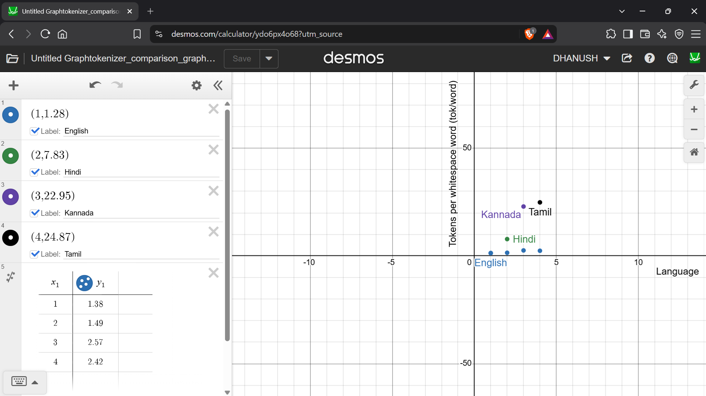

### Long-Context Throughput

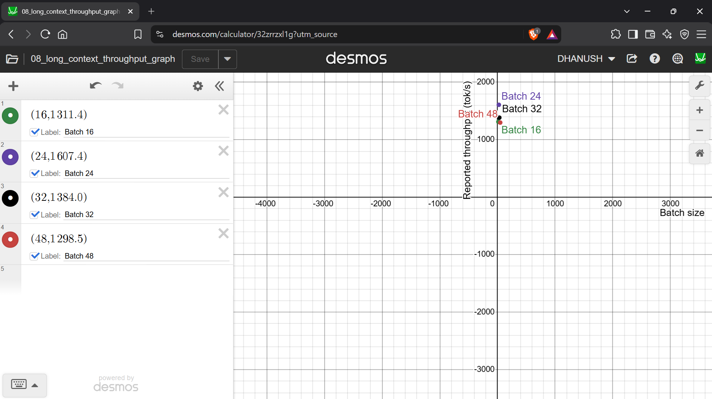

---

# Commands and Reproduction Steps

The main fertility benchmark can be reproduced from the repository root with:

```powershell
python fertility.py --corpus eng=partA/corpus/eng.txt --corpus hin=partA/corpus/hin.txt --corpus kan=partA/corpus/kan.txt --corpus tam=partA/corpus/tam.txt --tokenizer gpt2
```

The corpus files can also be checked directly for encoding issues using Python:

```powershell
python -c "from pathlib import Path; print(Path('partA/corpus/hin.txt').read_text(encoding='utf-8')[:300])"
```

Repository state can be checked at any point with:

```powershell
git status
```
